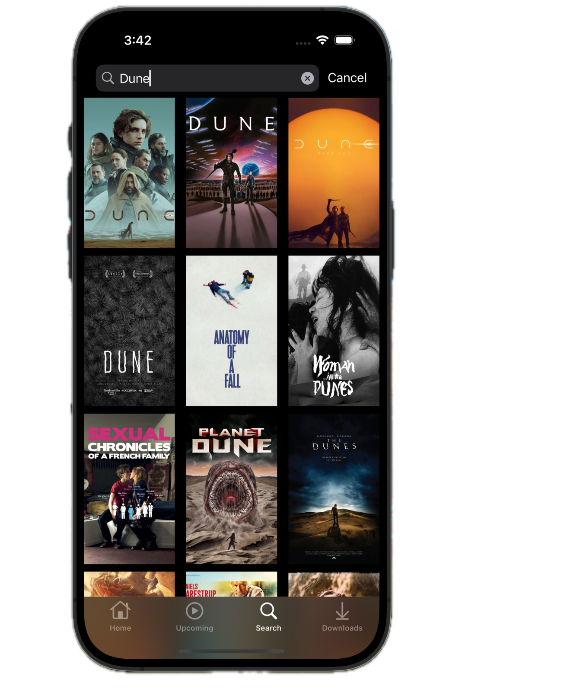
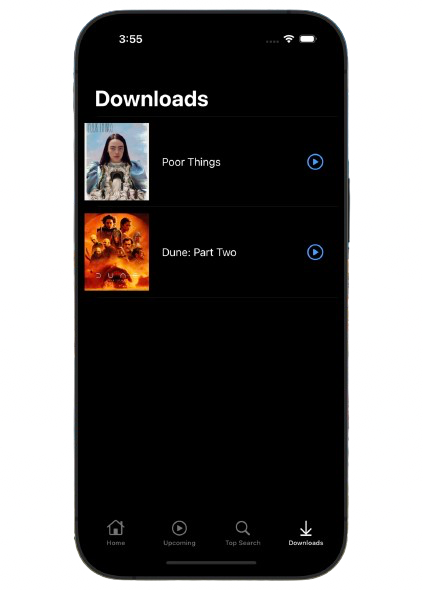

# Netflix Clone App

Full featured universal (iOS, macOS, iPadOS) app.

    
    
    
    

## Overview
- Written in Swift
- Uses both UIKit and SwiftUI
- Designed with MVVM pattern
- No External Dependencies
- Pagination Support for data
- Auto layout Based
- Universal App: Run on iPhone, iPad, and Mac
- Built in Xcode 15

## Design

The app has five key area:

1. Home Page
2. Search Section
3. List Section
4. Downloads Section
